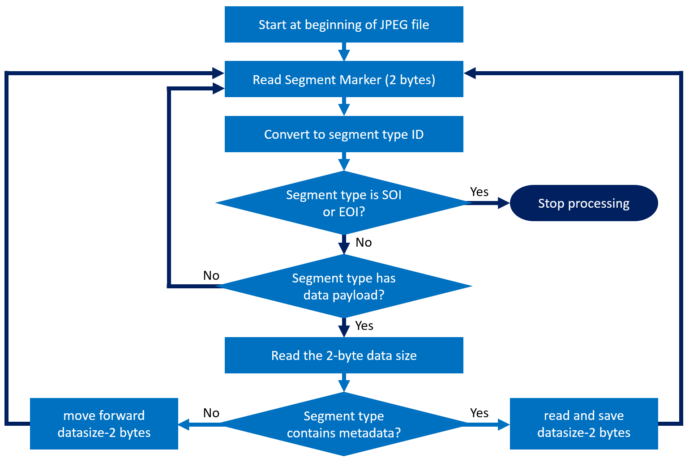
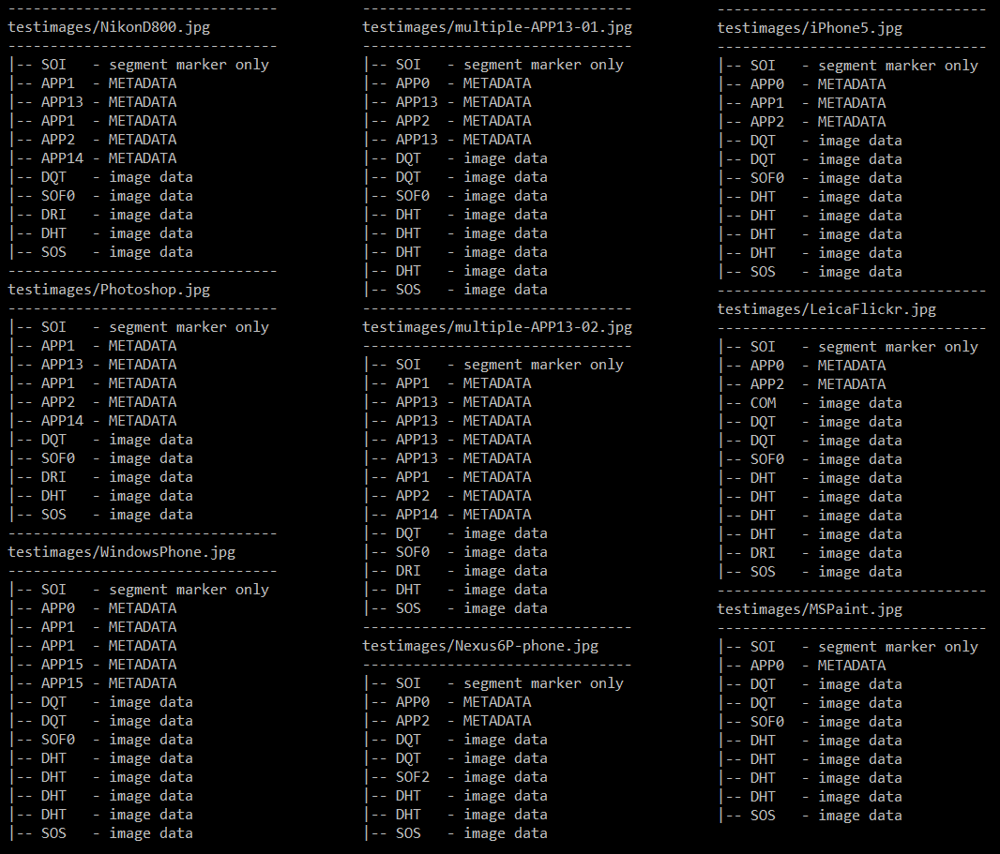

# jpeg-segments

This repo contains programs used for analyzing and displaying the segments in
JPEG files. Test images should be located in a testimages subfolder, and when
jpegsegments.py is run as a standlone program it will display the segment
architecture of those JPG files.

- jpegsegments.py = main program to navigate JPEG segments
- jpegdata.py = module of Exif specification data and test data
- tagnames_exif23.json = tag names from the Exif 2.3 specification
- output.txt = sample output of jpegsegments.py

Here is the algorithm implemented by jpegsegments.py to identify the segments in
a JPEG file:

Sample output from jpegsegments.py for a folder of test images:

